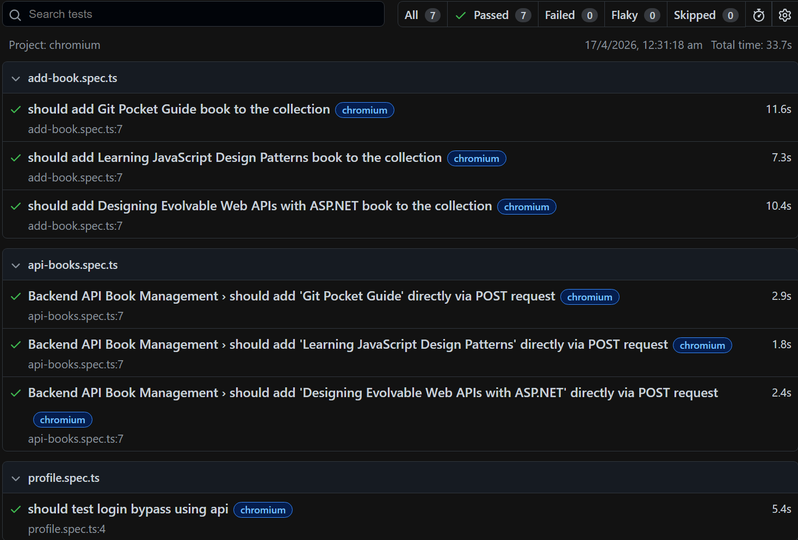

# Playwright Hybrid Automation Framework — DemoQA


A professional, high-performance hybrid (UI/API) test automation framework built with [Playwright](https://playwright.dev/) and TypeScript, targeting the [DemoQA BookStore](https://demoqa.com/books) application. This project showcases advanced SDET architectural patterns including API state injection, backend teardown, fixture chaining, and data-driven testing.

---

## Tech Stack

| Tool                                          | Purpose                              |
| --------------------------------------------- | ------------------------------------ |
| [Playwright](https://playwright.dev/)         | Cross-browser UI & API E2E framework |
| [TypeScript](https://www.typescriptlang.org/) | Type-safe test authoring             |
| GitHub Actions                                | CI/CD pipeline                       |

---

## Test Report



---

## Project Structure

```text
demoqa-fullstack-automation/
├── .github/
│   └── workflows/
│       └── playwright.yml        # CI pipeline
├── api-utils/
│   └── login.api.ts              # Direct API endpoint handlers
├── fixtures/
│   ├── auth.fixture.ts           # Handles token generation and state injection
│   ├── base.fixture.ts           # Merges fixtures into a single exportable test object
│   └── cleanup.fixture.ts        # Intercepts test teardown for instant API data deletion
├── page-objects/
│   ├── bookStore.page.ts         # BookStore page interactions
│   └── profile.page.ts           # Profile page interactions
├── test-data/
│   └── books.data.json           # JSON acting as the single source of truth
├── tests/
│   ├── add-book.spec.ts          # UI + API Hybrid tests
│   └── api-books.spec.ts         # Pure API Book Management tests
├── .env                          # Environment variables (Ignored by Git)
├── playwright.config.ts          # Playwright configuration
└── tsconfig.json                 # TypeScript configuration
```

---

## Key Features

### Hybrid Execution Model (UI + API Teardown)

Combines the validation of the UI layer with the speed of the API layer. Tests interact with the frontend, while custom `cleanUp` fixtures use direct backend `DELETE` API requests to instantly wipe database residue, ensuring zero test flakiness.

### API State Injection

`fixtures/auth.fixture.ts` completely bypasses slow UI login screens by generating and injecting JWT authentication tokens and User IDs directly into the browser context via cookies.

### Custom Fixture Chaining

Utilizes advanced Playwright `use()` mechanics to decouple authentication logic from data-cleanup logic. The backend teardown fixture natively inherits state from the authentication fixture.

### Data-Driven Testing (DDT)

Tests are parametrised using JSON data files from `test-data/`. Both the UI tests and API tests pull from a single source of truth (`books.data.json`) containing dynamic payloads (Titles and ISBNs).

### Page Object Model (POM)

All page interactions are encapsulated in dedicated page classes under `page-objects/`. This keeps tests clean and manages asynchronous UI events (like overcoming browser load delays and heavy ad scripts).

---

## Getting Started

### Prerequisites

- [Node.js](https://nodejs.org/) (LTS recommended)
- A registered account on [DemoQA](https://demoqa.com/login)

### Installation

```bash
# Install dependencies
npm install

# Install Playwright browsers
npx playwright install --with-deps
```

### Environment Setup

Create a `.env` file in the root directory and add your DemoQA credentials:

```env
BASE_URL=[https://demoqa.com](https://demoqa.com)
USERNAME=your_demoqa_username
PASSWORD=your_demoqa_password
```

### Running Tests

```bash
# Run the full test suite (all browsers, headless)
npx playwright test

# Run a specific test file
npx playwright test tests/api-books.spec.ts

# Run in UI mode for visual debugging
npx playwright test --ui

# Open the HTML report after a run
npx playwright show-report
```

---

## Configuration

All Playwright settings live in `playwright.config.ts`. Key behaviours:

| Setting  | Local                     | CI                        |
| -------- | ------------------------- | ------------------------- |
| Headed   | Configurable via `--ui`   | No                        |
| Retries  | 0                         | 2                         |
| Workers  | Default                   | 1                         |
| Trace    | On failure                | On failure                |
| Browsers | Chromium, Firefox, WebKit | Chromium, Firefox, WebKit |

TypeScript path aliases are configured in `tsconfig.json` for clean imports:

| Alias          | Resolves To      |
| -------------- | ---------------- |
| `@pages/*`     | `page-objects/*` |
| `@fixtures/*`  | `fixtures/*`     |
| `@test-data/*` | `test-data/*`    |
| `@api/*`       | `api-utils/*`    |

---

## CI/CD

The GitHub Actions workflow (`.github/workflows/playwright.yml`) triggers on every push to `main` and:

1. Checks out the repository
2. Sets up Node.js (LTS)
3. Installs dependencies via `npm ci`
4. Installs Playwright browsers with system dependencies
5. Injects GitHub Secrets (`BASE_URL`, `USERNAME`, `PASSWORD`) into the environment
6. Runs the full test suite
7. Uploads the HTML report as an artifact (retained for 30 days) on failure

---

## Test Coverage

| Area             | File                | Description                                                                 |
| ---------------- | ------------------- | --------------------------------------------------------------------------- |
| UI + API Hybrid  | `add-book.spec.ts`  | Authenticates via API, adds books via UI, instantly tears down via API.     |
| Pure Backend API | `api-books.spec.ts` | Authorized `POST` requests to add books, validating `201 Created` statuses. |
